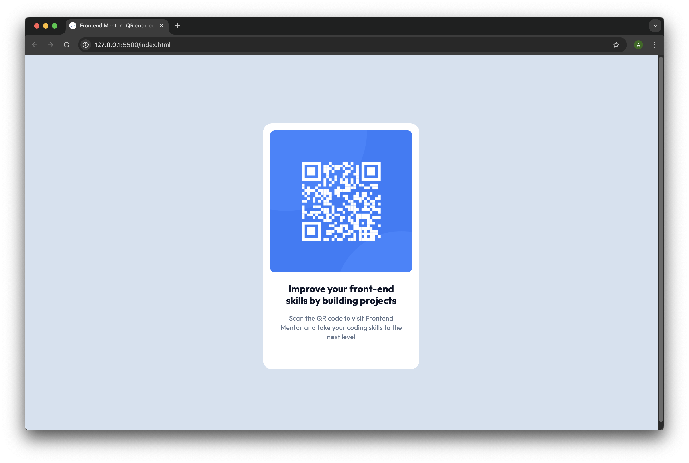

# Frontend Mentor - QR code component solution

This is my solution to the [QR code component challenge on Frontend Mentor](https://www.frontendmentor.io/challenges/qr-code-component-iux_sIO_H).  
It’s a beginner-level project to practice basic HTML & CSS layout.

## 🚀 Overview

### Screenshot

### Links

- Solution URL: [GitHub Repo](https://github.com/lyfu19/qr-code-component)
- Live Site URL: [Live Demo](https://nimble-choux-f5a00a.netlify.app/)

## 🔨 My process

### Built with

- Semantic HTML5 markup
- CSS custom properties
- Flexbox
- Mobile-first workflow

### What I learned

This project helped me practice:

- Structuring HTML layout with semantic tags
- Using Flexbox for vertical and horizontal centering
- Applying basic styling like border-radius, box-shadow, and spacing

### Useful resources

- [MDN Web Docs - Flexbox](https://developer.mozilla.org/en-US/docs/Web/CSS/CSS_Flexible_Box_Layout/Basic_Concepts_of_Flexbox) – helpful for understanding centering content

## ✍️ Author

- Frontend Mentor – [@Alfie](https://www.frontendmentor.io/profile/lyfu19)
- GitHub – [@Alfie](https://github.com/lyfu19/qr-code-component)
